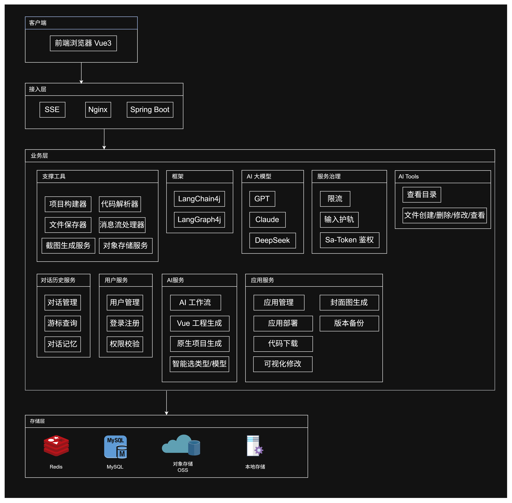
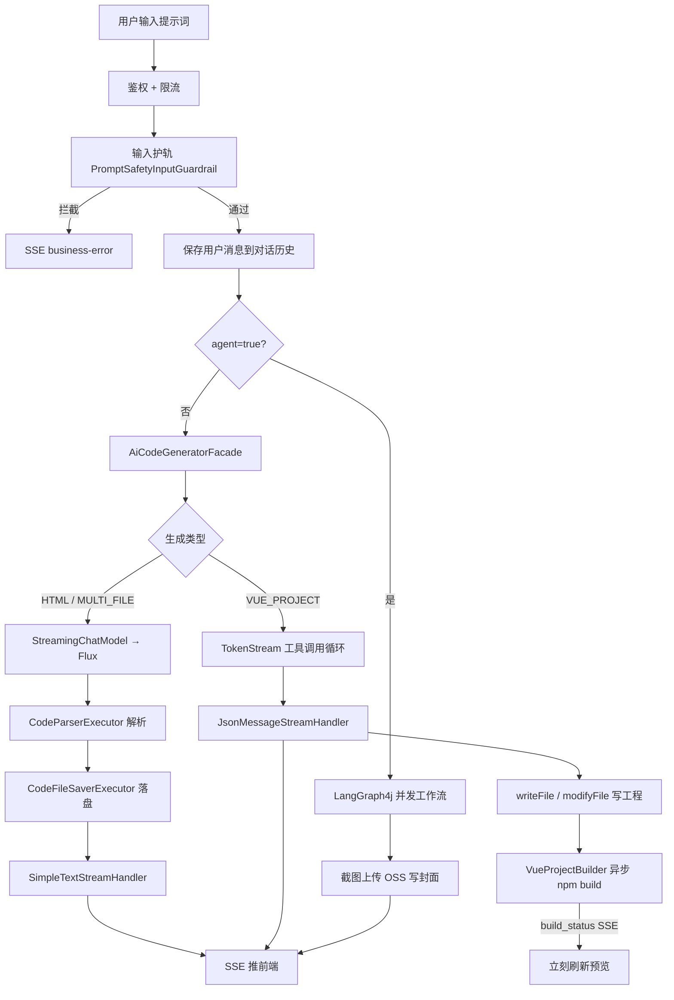
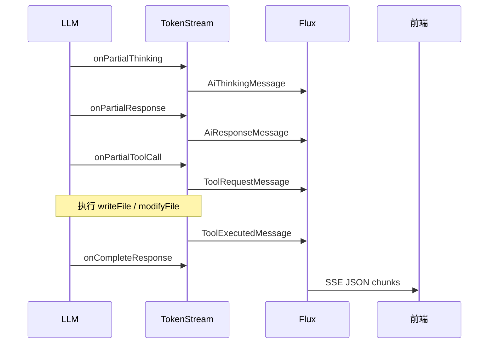
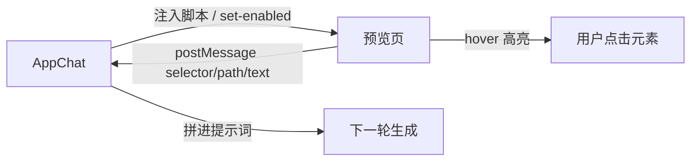
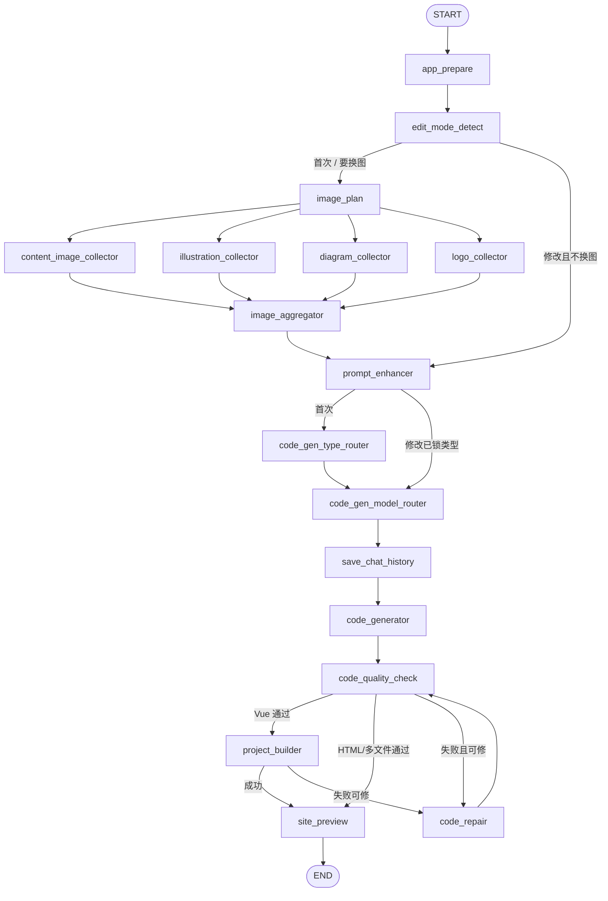

# Casy AI 智能代码生成平台

用自然语言生成网站：原生 HTML / 多文件静态站 / Vue 工程。对话式迭代、实时预览、一键部署。

**后端** Spring Boot 4 + Java 24 + LangChain4j + LangGraph4j  
**前端** Vue 3 + Vite + Ant Design Vue + Monaco Editor

---

## 技术栈

| 层级 | 技术                                                                    |
| --- |-----------------------------------------------------------------------|
| 后端 | Spring Boot 4.0、Java 24 虚拟线程、Spring WebFlux `Flux` / SSE              |
| AI | LangChain4j 1.14、LangGraph4j 1.8、AiServices / TokenStream / Guardrail |
| 模型 | DeepSeek V4 Flash / Pro、Claude Sonnet 4.6、GPT-5.5（OpenAI 兼容协议）        |
| 数据 | MySQL + MyBatis-Flex、Redis（Session / 对话记忆 / 精选缓存）                     |
| 鉴权 | Sa-Token + Redis 分布式 Session                                          |
| 构建 | npm + 共用 `node_modules`（Windows Junction / Linux symlink）             |
| 截图 | Selenium + Chrome Headless → 阿里云 OSS                                  |
| 前端 | Vue 3、Pinia、Vue Router、Ant Design Vue、Monaco、EventSource SSE          |

---

## 系统架构


---

## 核心业务：代码生成流程



---

## 1. LangChain4j 多模型接入与成本控制

`AiCodeGeneratorServiceFactory` 是策略上下文：启动时收集全部 `ModelProvider`，按 `ModelTypeEnum` 选模型，再按 `CodeGenTypeEnum` 组装 `AiServices`。

| 场景 | 模型策略 |
| --- | --- |
| HTML / 多文件静态页 | 可用 Flash 等低成本模型，同步 `ChatModel` + 流式 `StreamingChatModel` |
| Vue 工程（工具调用） | 走能力更强的模型 + `tools` + `TokenStream` |
| 类型/模型路由、图片规划、质检 | 独立 routing 模型（如 qwen flash），不进代码生成策略表 |
| 用户未指定模型 | `AiCodeModelTypeRoutingService` 按复杂度选**能完成任务的最便宜模型** |

新增模型只需：枚举 + `*ModelConfig` 注册 `ModelProvider`，工厂无需改动（开闭原则）。

每个 `appId` 的 `AiCodeGeneratorService` 用 Caffeine 缓存；对话记忆只绑 `appId`，切换模型不丢上下文。

---

## 2. SSE 流式输出

`GET /app/chat/gen/code` 产出 `text/event-stream`。

- 文本 chunk 包成 `{"c":"..."}`，避免 EventSource 丢空格
- 思考 token 带 `"t":"thinking"`
- 结束推 `event: done`
- 护轨拦截推 `event: business-error`（不走浏览器默认 `error`）
- 前端 `EventSource` 实时拼 Markdown / 代码面板

---

## 3. 门面 + 策略 / 模板 / 执行器

`AiCodeGeneratorFacade` 对外只暴露 `generateAndSaveCode` / `generateAndSaveCodeStream` / `repairCodeStream`。

| 模式 | 职责 | 关键类 |
| --- | --- | --- |
| 门面 | 按类型分流、流结束落盘、TokenStream → Flux | `AiCodeGeneratorFacade` |
| 策略 | 模型选择、解析器/保存器按类型分派 | `ModelProvider`、`CodeParserExecutor`、`CodeFileSaverExecutor` |
| 模板 | 校验 → 建目录 → 写文件 | `CodeFileSaverTemplate` |
| 执行器 | 流后处理：纯文本 vs JSON 工具消息 | `StreamHandlerExecutor` |

HTML / 多文件：流式收集完整文本 → 解析 → `createCodeVersion` → 保存。  
Vue：工具在生成过程中直接写盘，流结束不走解析器。

---

## 4. 预览与部署

**预览**：`StaticResourceController` 映射 `/api/static/{deployKey}/**` → `tmp/code_output`。  
目录名即 deployKey，例如 `html_{appId}_v1`、`vue_project_{appId}_v2`。Vue 预览 `dist/index.html`。

**部署**：`deployApp` 生成 6 位 `deployKey`，Vue 先 `npm run build` 再拷 `dist` 到 `tmp/code_deploy/{deployKey}`，返回 `{deployHost}/{deployKey}/`，随后异步截封面。

---

## 5. 对话历史、游标、记忆、Redis Session

**游标分页**：`lastCreateTime` 作为游标，`create_time < lastCreateTime` 再取一页，避免深分页。前端首屏按时间降序取页后反转展示；上滑「加载更多」用当前最早一条的 `createTime` 作游标，并补偿 `scrollHeight` 防止跳动。

**保存**：发送前写用户消息；流结束写 AI 消息（Vue 含 thinking 编码）；失败写错误消息。`parentId` 关联一轮对话。

**记忆持久化**：`MessageWindowChatMemory`（窗口 20）+ `RedisChatMemoryStore`。创建服务时从 MySQL 回填 Redis，跳过最新一条用户消息，避免与 LangChain4j 自动入记忆重复。

**Session**：Sa-Token + `sa-token-redis-template`，Token 存 Redis，多实例共享登录态。

---

## 6. Vue 工程构建 / 浏览 / 共用 node_modules、TokenStream

```
tmp/code_output/
  vue_project_{appId}_v1/     # 版本源码 + dist
  vue_project_{appId}_v2/
  vue_project_{appId}_shared/  # 共用 node_modules
      node_modules/  <── v1/v2 以 Junction / symlink 指向这里
```

仅当 `package.json` 变化或 shared 无依赖时在 shared 执行 `npm install`，各版本只 `npm run build`。

**TokenStream 处理**（`processTokenStream`）：



构建进度由 `VueBuildStatusNotifier` 推 `event: build_status`，前端不再轮询版本列表。

---

## 7. 封面图与代码包下载

生成/部署后 `generateAppCoverAsync`（虚拟线程）：等待约 2s 避免白屏 → Selenium 截图 → 压缩 JPG 上传 OSS（`screenshots/yyyy/MM/dd/`）→ 写 `t_app.cover`。

工作流结束 `SitePreviewNode.awaitCover`，把封面 Markdown 写入本轮 SSE，对话里直接出预览图。

下载：`GET /app/download/{appId}/{codeDir}`，过滤 `node_modules` / `dist` / `.git` 等后打 zip。

---

## 8. 可视化修改

**方案**：预览 iframe 与主站同源，主站在 iframe `load` 后注入原生选择脚本（不依赖 Vue 运行时）。

**通信**：



选中信息：`tagName`、`id`、`class`、文本摘要、CSS 选择器、DOM 路径。发送时 `appendSelectedElementToPrompt` 附加「请优先围绕该元素修改」。

| 类型 | 修改方式 |
| --- | --- |
| HTML / MULTI_FILE | 整段再生 → 解析落盘覆盖版本目录 |
| Vue 工程 | 工具读文件 + `modifyFile` / `writeFile` 改源码 → 再 build |

---

## 9. AI 工作流（LangGraph4j）

状态在 `WorkflowContext`（挂在 `MessagesState`）。节点异步 `node_async`；图片收集四路并行后聚合。修改已有站走短路径（跳过搜图、锁生成类型）。质检/构建失败最多修复 3 次。



技术点：条件边路由、并发 fan-out/fan-in、虚拟线程跑图、DevTools 下给虚拟线程设置 `WorkflowContext` 的 ClassLoader、工作流进度经 `WorkflowChatEmitter` 切块 SSE。

---

## 10. AI 并发调用

`OpenAiChatModel.chat()` 同步阻塞，单例会把多路请求串行化。

处理：

- `ChatModel` / `StreamingChatModel` 设 `@Scope("prototype")`，每次 `getChatModel()` 新建实例
- JDK `HttpClient` 进程内单例、线程安全，多模型共用连接池与超时
- 工作流图片节点、质检、路由工厂均为 prototype
- `CodeGenContextHolder` 双重检查锁，并发写文件只建一条版本记录
- SSE 按 `appId` 绑定 sink，多应用同时生成互不抢流

---

## 11. Redis 缓存（首页精选）

`listGoodAppVOByPage` 使用 `@Cacheable(value = "good_app_page")`。

- 仅缓存前 10 页
- TTL 5 分钟（默认缓存 30 分钟）
- Key 由查询参数生成
- Jackson 开启 default typing，反序列化还原 `Page` / `AppVO`

---

## 12. 实时浏览与封面 SSE

- 静态检测 `cache: 'no-store'`，生成后立刻打到最新文件
- Vue：`EventSource /tAppVersion/build/stream`，`build_status=success` 后立刻加载 `dist`
- HTML/多文件：流结束落盘即可刷新 iframe
- 封面：虚拟线程截图 → OSS → 工作流 SSE 推 ``，应用卡片同步更新 `cover`

---

## 13. 稳定性：护轨、重试、工具循环

**输入护轨**：长度、空内容、敏感词、注入正则；命中 `fatal` → `GuardrailBlockedException` → SSE `business-error` 并落库审计。

**输出重试**：`OutputGuardrailsConfig.maxRetries = 3`。流式场景不挂输出护轨（会攒完全文再返回，破坏打字机效果）。

**工具调用**：

- `maxSequentialToolsInvocations(20)` 切断无限循环
- `hallucinatedToolNameStrategy` 把幻觉工具名回传模型
- `RepairingToolExecutor` 在 Jackson 解析前修复非法 tool JSON
- `toolArgumentsErrorHandler` 把解析错误回传模型自行纠正
- 幻觉/失败不中断整条流

---

## 仓库结构

```
casy-ai-code-mother/
├── README.md                              # 项目说明（本文件）
├── pom.xml                                # 后端 Maven 依赖
├── img.png                                # 系统架构图
├── sql/                                   # 建表与升级脚本
│   ├── createTable_mysql.sql
│   ├── createTable_postgresql.sql
│   └── upgrade_t_sys_param.sql
├── doc/                                   # 设计笔记、示例提示词
├── src/main/java/com/casy/casyaicodemother/
│   ├── CasyAiCodeMotherApplication.java   # 启动类
│   ├── ai/                                # 多模型接入、护轨、工具
│   │   ├── AiCodeGeneratorServiceFactory.java
│   │   ├── claude/                        # Claude Sonnet 接入
│   │   ├── deepseek/                      # DeepSeek Flash / Pro
│   │   ├── gpt/                           # GPT OpenAI 兼容协议
│   │   ├── routing/                       # 类型/模型路由模型
│   │   ├── guardrail/                     # 输入护轨、输出重试
│   │   └── tools/                         # writeFile / modifyFile 等
│   ├── core/                              # 代码生成门面与落盘
│   │   ├── AiCodeGeneratorFacade.java     # 对外唯一入口
│   │   ├── parser/                        # HTML / 多文件解析
│   │   ├── save/                          # 模板方法写盘
│   │   ├── handler/                       # SSE 流后处理
│   │   ├── builder/                       # Vue npm build + 进度 SSE
│   │   └── vue/                           # 版本目录、共用 node_modules
│   ├── langgraph4j/                       # Agent 工作流
│   │   ├── workflow/                      # 并发图编排
│   │   ├── node/                          # 准备、路由、生成、质检、修复、预览
│   │   └── node/concurrent/               # 搜图四路并行 + 聚合
│   ├── controller/                        # HTTP / SSE 接口
│   ├── service/                           # 应用、对话、版本、截图、参数
│   ├── mapper/                            # MyBatis-Flex Mapper
│   ├── model/                             # entity / dto / vo / enums
│   ├── config/                            # Redis、Sa-Token、OSS、HTTP Client
│   ├── ratelimiter/                       # 接口限流切面
│   └── manager/oss/                       # 封面图上传
├── src/main/resources/
│   ├── application.yaml                   # 主配置（local / prod 覆盖）
│   ├── prompt/                            # 系统提示词与路由 prompt
│   ├── mapper/                            # XML Mapper
│   └── nginx.conf
└── casy-ai-code-mother-frontend/          # Vue 3 工作台
    ├── vite.config.ts
    ├── src/
    │   ├── views/
    │   │   ├── Home.vue                   # 首页创建应用
    │   │   ├── about/                     # 关于作者 / 关于项目
    │   │   ├── app/                       # 对话、应用/版本/历史管理
    │   │   ├── ai/                        # 模型管理
    │   │   ├── sys/                       # 系统参数
    │   │   └── user/                      # 登录注册、用户管理
    │   ├── components/                    # 顶栏、代码工作区、Monaco、文件树
    │   ├── api/                           # OpenAPI 生成的接口
    │   ├── stores/                        # Pinia（登录态、主题）
    │   ├── router/                        # 路由
    │   └── utils/                         # Markdown、预览、可视化选元素
    └── doc/                               # 前端文档与简历等

# 运行时生成（不入库）
tmp/code_output/                           # 预览源码与 Vue dist
tmp/code_deploy/                           # 部署静态站
```

---

## 快速启动

**环境**：JDK 24、MySQL、Redis、Node.js、Chrome（封面截图）

```bash
# 后端
# 配置 src/main/resources/application-local.yaml（数据源、Redis、各模型 API Key、OSS）
mvn spring-boot:run

# 前端
cd casy-ai-code-mother-frontend
pnpm install
pnpm dev
```

接口文档：Knife4j（SpringDoc OpenAPI 3）。

