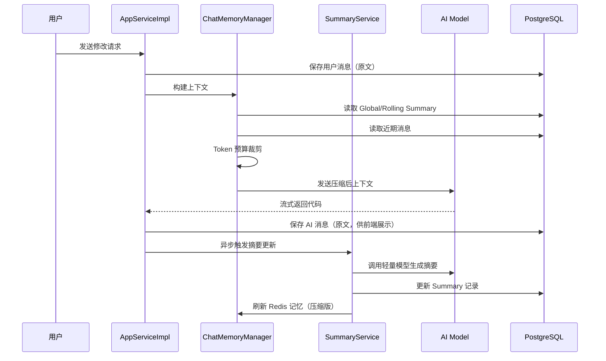

# 智能对话历史压缩与记忆优化设计方案

## 1. 背景与问题分析

### 1.1 当前配置

| 配置项 | 当前值 | 位置 |
|--------|--------|------|
| `max-tokens` | 8192 | `application.yaml` / `GptModelProperties` |
| 对话窗口 | 20 条消息 | `AiCodeGeneratorServiceFactory` |
| 记忆存储 | Redis + PostgreSQL | `RedisChatMemoryStore` + `t_chat_history` |

### 1.2 max-tokens: 8192 的真实含义

`max-tokens` 限制的是 **单次 AI 响应的最大输出 Token 数**，不是上下文窗口上限。

```
请求 Token 预算 = System Prompt + 历史对话 + 当前用户消息
响应 Token 预算 = max-tokens（8192）
```

两者独立计算。多轮对话的问题主要来自 **输入侧 Token 膨胀**，而非 max-tokens 本身。

### 1.3 多轮对话存在的具体问题

#### 问题一：AI 响应体过大，历史消息极度耗 Token

本项目的 AI 每次响应包含完整 HTML/CSS/JS 代码。实测单轮 AI 响应可达 **3000~8000+ Token**。

当前 `loadChatHistoryToMemory` 将完整 `message` 原文注入 `MessageWindowChatMemory`：

```java
chatMemory.add(AiMessage.from(chatHistory.getMessage())); // 完整代码原文
```

20 条消息（10 轮对话）的输入 Token 估算：

| 组成部分 | 估算 Token |
|----------|-----------|
| System Prompt | ~800 |
| 10 轮用户消息（每轮 ~100） | ~1000 |
| 10 轮 AI 完整代码响应（每轮 ~5000） | **~50000** |
| 当前用户消息 | ~100 |
| **合计** | **~52000** |

远超多数模型的有效上下文（DeepSeek-V3: 64K，GPT-4o-mini: 128K），且大量 Token 用于重复传递已落盘的旧代码。

#### 问题二：输出截断风险

复杂站点的三文件代码输出可能超过 8192 Token，导致：

- JSON/Markdown 代码块被截断，解析失败
- 流式输出末尾缺失 `</html>` 等闭合标签

#### 问题三：滑动窗口记忆丢失

`MessageWindowChatMemory.maxMessages(20)` 采用 **硬截断**：超出 20 条后直接丢弃最早消息，无渐进式压缩。

用户第 1 轮说「网站主题是宠物店」，第 15 轮说「把导航栏改成深色」——若第 1 轮消息已被截断，AI 可能丢失核心需求上下文。

#### 问题四：记忆与代码版本脱节

项目已有 `t_app_version` 版本管理，但对话记忆仍保存完整代码文本。实际上：

- **代码状态** → 应由版本文件系统承载
- **对话记忆** → 应保留用户意图、设计决策、修改历史摘要

当前架构将两者混存，既浪费 Token，又降低记忆质量。

### 1.4 结论

| 风险 | 严重程度 | 触发条件 |
|------|---------|---------|
| 输入 Token 超限 / 费用暴涨 | 高 | 5 轮以上代码生成对话 |
| AI 响应截断 | 中 | 复杂多文件站点单次生成 |
| 早期意图丢失 | 中 | 10 轮以上迭代 |
| 模型响应变慢 | 中 | 历史消息累积 |

**需要引入智能对话历史压缩机制。**

---

## 2. 设计目标

1. **节省 Token**：输入 Token 控制在可配置预算内（默认 12000）
2. **优化记忆**：保留用户核心意图、设计决策、版本演进脉络
3. **最小侵入**：兼容现有 `ChatHistory` 表、Redis 记忆、LangChain4j 体系
4. **代码与记忆分离**：AI 响应的完整代码不入记忆，改由版本摘要替代

---

## 3. 整体架构

### 3.1 分层记忆模型

```
┌─────────────────────────────────────────────────────┐
│                   发送给 AI 的上下文                    │
├─────────────────────────────────────────────────────┤
│  Layer 0: System Prompt（固定，~800 Token）           │
├─────────────────────────────────────────────────────┤
│  Layer 1: 全局摘要（Global Summary，~500 Token）      │
│  → 应用级长期记忆，跨会话持久化                        │
├─────────────────────────────────────────────────────┤
│  Layer 2: 滚动摘要（Rolling Summary，~800 Token）   │
│  → 近期多轮对话的压缩摘要                              │
├─────────────────────────────────────────────────────┤
│  Layer 3: 近期原始消息（Recent Raw，~3000 Token）   │
│  → 最近 N 轮完整 user/ai 消息（ai 消息为压缩版）       │
├─────────────────────────────────────────────────────┤
│  Layer 4: 当前用户消息（Current Message）             │
└─────────────────────────────────────────────────────┘
```

### 3.2 核心流程



---

## 4. 详细设计

### 4.1 AI 消息双轨存储

`t_chat_history` 保持现有结构不变（`message` 存原文，供前端历史展示）。

新增 `t_chat_memory_snapshot` 表，存储注入 AI 的压缩版记忆：

```sql
CREATE TABLE t_chat_memory_snapshot (
    id              BIGINT PRIMARY KEY,
    app_id          BIGINT       NOT NULL,
    chat_history_id BIGINT       NOT NULL,  -- 关联原始消息
    compressed_msg  TEXT         NOT NULL,  -- 压缩后内容
    token_count     INT          DEFAULT 0,
    create_time     TIMESTAMP    DEFAULT CURRENT_TIMESTAMP
);
CREATE INDEX idx_memory_snapshot_app_id ON t_chat_memory_snapshot (app_id);
```

**AI 消息压缩规则（无需调用模型，规则引擎即可）：**

| 消息类型 | 注入记忆的内容 | 示例 |
|---------|--------------|------|
| USER | 原文保留 | `把导航栏背景改成深蓝色` |
| AI（代码生成） | 结构化摘要 | `[v3] 已生成宠物店首页：响应式布局、轮播图、联系表单。修改点：导航栏深色主题` |
| AI（错误） | 原文保留 | `生成失败：连接超时` |

压缩摘要生成逻辑（规则版）：

```java
// AI 代码响应压缩模板
String compressAiCodeMessage(String rawMessage, int versionNum) {
    // 1. 剥离 ```html/css/javascript 代码块
    // 2. 保留代码块外的说明文字
    // 3. 追加版本号和文件清单
    return String.format("[v%d] %s。文件：index.html, style.css, script.js", 
        versionNum, extractDescription(rawMessage));
}
```

### 4.2 智能摘要服务（SummaryService）

#### 4.2.1 两级摘要

| 摘要类型 | 更新时机 | 覆盖范围 | 目标 Token |
|---------|---------|---------|-----------|
| Rolling Summary | 每 3 轮对话后 | 最近被移出原始窗口的消息 | ≤ 800 |
| Global Summary | 每 5 轮对话后 | 全应用历史意图与决策 | ≤ 500 |

#### 4.2.2 摘要 Prompt 模板

```
你是一个对话记忆压缩助手。请将以下对话历史压缩为简洁摘要。

要求：
1. 保留：用户核心需求、设计偏好、已确认的功能点、被拒绝的方案
2. 丢弃：完整代码、重复描述、寒暄
3. 格式：分点列表，每点不超过 30 字
4. 总长度不超过 {maxTokens} Token

【已有摘要】
{existingSummary}

【待压缩的新消息】
{newMessages}

请输出更新后的完整摘要：
```

#### 4.2.3 摘要存储

新增 `t_chat_summary` 表：

```sql
CREATE TABLE t_chat_summary (
    id              BIGINT PRIMARY KEY,
    app_id          BIGINT       NOT NULL UNIQUE,
    global_summary  TEXT,                     -- 全局摘要
    rolling_summary TEXT,                     -- 滚动摘要
    last_summary_at TIMESTAMP,                -- 上次摘要时间
    message_count   INT          DEFAULT 0,   -- 已摘要消息数
    update_time     TIMESTAMP    DEFAULT CURRENT_TIMESTAMP
);
```

### 4.3 Token 预算管理器（TokenBudgetManager）

```java
public class TokenBudgetConfig {
    int totalInputBudget = 12000;    // 总输入预算
    int systemPromptBudget = 800;    // Layer 0
    int globalSummaryBudget = 500;   // Layer 1
    int rollingSummaryBudget = 800;  // Layer 2
    int recentRawBudget = 3000;      // Layer 3
    int reservedForCurrent = 500;    // Layer 4 预留
    int recentRawRounds = 3;         // 保留最近 3 轮原始消息
}
```

**裁剪优先级（从先到后丢弃）：**

1. 缩减 Recent Raw 轮数（3 → 2 → 1）
2. 截断 Rolling Summary（保留尾部）
3. 压缩 Global Summary（触发重新摘要）
4. 拒绝请求并提示用户「对话过长，建议新建应用」

**Token 估算：** 使用 LangChain4j 内置 `TokenCountEstimator`（或按字符数 × 0.4 粗估中文）。

### 4.4 自定义 ChatMemory 实现

替换 `MessageWindowChatMemory`，实现 `CompressibleChatMemory`：

```java
public class CompressibleChatMemory implements ChatMemory {
    
    private final Long appId;
    private final ChatSummaryService summaryService;
    private final TokenBudgetManager budgetManager;
    private final RedisChatMemoryStore store;
    
    @Override
    public void add(ChatMessage message) {
        // 1. AI 代码消息 → 规则压缩后存入
        // 2. 用户消息 → 原文存入
        // 3. 检查 Token 预算，触发滚动摘要
    }
    
    @Override
    public List<ChatMessage> messages() {
        List<ChatMessage> context = new ArrayList<>();
        // Layer 1: Global Summary → SystemMessage 形式注入
        context.add(SystemMessage.from("【历史摘要】\n" + globalSummary));
        // Layer 2: Rolling Summary
        if (rollingSummary != null) {
            context.add(SystemMessage.from("【近期摘要】\n" + rollingSummary));
        }
        // Layer 3: Recent Raw Messages（压缩版 AI 消息）
        context.addAll(recentMessages);
        return budgetManager.trim(context);
    }
}
```

### 4.5 摘要触发策略

```java
public class SummaryTriggerPolicy {
    
    // 滚动摘要：移出原始窗口的消息数 ≥ 4 时触发
    boolean shouldUpdateRollingSummary(int evictedMessageCount) {
        return evictedMessageCount >= 4;
    }
    
    // 全局摘要：每累计 5 轮对话触发一次
    boolean shouldUpdateGlobalSummary(int totalRounds) {
        return totalRounds % 5 == 0;
    }
    
    // 强制摘要：输入 Token 预估超过预算 80%
    boolean shouldForceCompress(int estimatedTokens, int budget) {
        return estimatedTokens > budget * 0.8;
    }
}
```

摘要更新采用 **异步执行**（`@Async`），不阻塞用户请求的流式响应。

### 4.6 与版本系统的联动

```
用户: "把按钮改成圆角"
  ↓
AI 生成 v4 代码 → 保存到 tmp/code_output/..._v4/
  ↓
记忆注入: "[v4] 按钮样式改为圆角，保持蓝色主题。文件：index.html, style.css, script.js"
  ↓
Global Summary 追加: "· 按钮圆角设计（v4确认）"
```

版本号从 `AppVersionService` 获取，确保摘要与实际代码版本一致。

---

## 5. 模块划分

```
com.casy.casyaicodemother.memory
├── CompressibleChatMemory.java          # 自定义记忆实现
├── ChatMemoryManager.java               # 记忆构建与刷新
├── TokenBudgetManager.java              # Token 预算裁剪
├── TokenBudgetConfig.java               # 配置类
├── compressor
│   ├── MessageCompressor.java           # 压缩器接口
│   ├── AiCodeMessageCompressor.java     # AI 代码消息规则压缩
│   └── UserMessageCompressor.java       # 用户消息（透传）
├── summary
│   ├── ChatSummaryService.java          # 摘要服务接口
│   ├── ChatSummaryServiceImpl.java      # 摘要服务实现
│   ├── SummaryTriggerPolicy.java        # 触发策略
│   └── SummaryPromptBuilder.java        # Prompt 构建
└── model
    ├── ChatSummary.java                 # 摘要实体
    └── ChatMemorySnapshot.java          # 压缩快照实体
```

---

## 6. 配置项

```yaml
ai:
  memory:
    enabled: true
    total-input-budget: 12000        # 总输入 Token 预算
    recent-raw-rounds: 3               # 保留最近 N 轮原始消息
    rolling-summary-max-tokens: 800
    global-summary-max-tokens: 500
    rolling-trigger-interval: 3        # 每 N 轮触发滚动摘要
    global-trigger-interval: 5         # 每 N 轮触发全局摘要
    summary-model: deepseek-v4-flash   # 摘要专用模型（可用轻量模型）
    async-summary: true                # 异步摘要
```

---

## 7. 改造点清单

| 序号 | 改造文件 | 改动说明 |
|------|---------|---------|
| 1 | `AiCodeGeneratorServiceFactory` | 替换 `MessageWindowChatMemory` → `CompressibleChatMemory` |
| 2 | `ChatHistoryServiceImpl` | `loadChatHistoryToMemory` 改为加载压缩版消息 |
| 3 | `AppServiceImpl.chatToGenCode` | AI 响应完成后触发异步摘要 |
| 4 | 新增 `memory` 包 | 核心压缩与摘要逻辑 |
| 5 | `sql/createTable.sql` | 新增 `t_chat_summary`、`t_chat_memory_snapshot` |
| 6 | `application.yaml` | 新增 `ai.memory` 配置段 |

**不需要改动的部分：**

- `t_chat_history` 表结构（前端历史展示仍用原文）
- `AiCodeGeneratorService` 接口
- 流式输出链路
- Redis 存储机制（存储压缩后的消息）

---

## 8. 效果预估

以 10 轮代码迭代对话为例：

| 指标 | 改造前 | 改造后 |
|------|--------|--------|
| 输入 Token | ~52000 | ~8000 |
| 记忆保留质量 | 仅最近 20 条原文 | 全局意图 + 滚动摘要 + 近 3 轮细节 |
| 早期意图丢失 | 第 1 轮易被截断 | Global Summary 持久保留 |
| 额外 AI 调用 | 0 | 每 3~5 轮 1 次轻量摘要（~200 Token） |
| 单次摘要成本 | - | ≈ 摘要模型单次调用费用 |

Token 节省率约 **85%**，摘要的额外成本远低于节省的输入 Token 费用。

---

## 9. 实施计划

### Phase 1：规则压缩（1~2 天）

- 实现 `AiCodeMessageCompressor`，AI 代码消息不入记忆原文
- 实现 `TokenBudgetManager` 基础裁剪
- 改造 `loadChatHistoryToMemory`

**收益：** 解决 80% 的 Token 膨胀问题，无需额外 AI 调用。

### Phase 2：滚动摘要（2~3 天）

- 新增 `t_chat_summary` 表
- 实现 `ChatSummaryService` + 异步触发
- 实现 `CompressibleChatMemory`

**收益：** 解决记忆丢失问题，支持 20+ 轮对话。

### Phase 3：全局摘要 + 监控（1~2 天）

- Global Summary 机制
- Token 用量日志与告警
- 配置项外化

**收益：** 长期迭代稳定性，可观测性。

---

## 10. 风险与兜底

| 风险 | 兜底策略 |
|------|---------|
| 摘要丢失关键细节 | Recent Raw 保留最近 3 轮完整用户消息 |
| 摘要模型调用失败 | 降级为规则压缩，不阻塞主流程 |
| 摘要质量不佳 | 提供 `regenerateSummary(appId)` 管理接口 |
| 输入仍超限 | 返回明确错误：「对话历史过长，请新建应用继续」 |
| 输出超 8192 截断 | 独立配置 `max-tokens` 为 16384，或拆分生成策略 |

---

## 11. 附录：max-tokens 调优建议

`max-tokens: 8192` 对于代码生成场景偏紧，建议：

```yaml
ai:
  gpt:
    max-tokens: 16384    # 代码生成场景建议值
  memory:
    total-input-budget: 12000  # 输入预算独立控制
```

输入预算由记忆压缩系统管理，输出预算由 `max-tokens` 管理，两者解耦。
